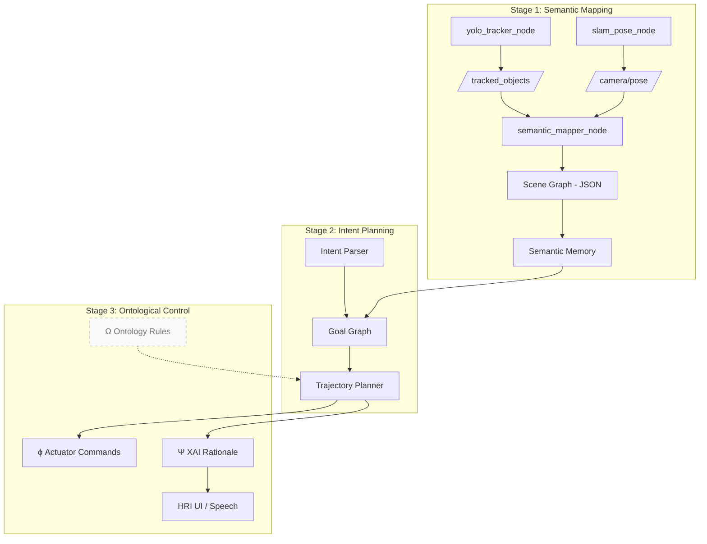

<!--
 ██████╗ ███████╗ ██████╗  ██████╗
██╔═══██╗██╔════╝██╔════╝ ██╔════╝
██║   ██║█████╗  ██║  ███╗██║  ███╗
██║   ██║██╔══╝  ██║   ██║██║   ██║
╚██████╔╝███████╗╚██████╔╝╚██████╔╝
 ╚═════╝ ╚══════╝ ╚═════╝  ╚═════╝

Cognitive Synergy Architecture (CSA)
A next-generation, research-grade cognition stack
for collaborative, human-centric robots
-->

<p align="center">
  
</p>

# 📚 Cognitive Synergy Architecture (CSA)

> **Modular cognition for robots that *perceive*, *reason*, and *co-think* with humans.**

CSA is a multistage robotics framework that unifies **semantic perception**, **adaptive planning**, and
**explainable control** under a single, ROS 2–native codebase.
It is organized into three tightly-coupled sub-architectures **SEGO**, **IMAGO**, and **LOGOS** that
together deliver a full perception-to-action loop with built-in reasoning, safety, and self-reflection.

| Sub-Architecture | Core Question                 | Key Capabilities (current state)                        |
|------------------|-------------------------------|---------------------------------------------------------|
| **SEGO**<br>*(Semantic Graph Ontology mapper)* | “**What** exactly am I seeing?” | • Real-time RGB-D detection (YOLO v5)<br>• Multi-object tracking (StrongSORT)<br>• 6-DoF pose fusion (ORB-SLAM2 / RTAB-Map)<br>• 3-D semantic mapping + scene-graph export |
| **IMAGO**<br>*(Intent Modeling & Action Generation Operator)* | “**Why** should I act and **how** do I adapt my plan?” | • Natural-language intent parsing (LLM plugin)<br>• Symbolic & neuro-symbolic planners (HTN, BT, CoT)<br>• PPO-based self-adaptation + meta-controller |
| **LOGOS**<br>*(Logical Ontological Generator for Self-adjustment)* | “Does my behaviour remain **safe**, **valid**, and **explainable**?” | • Run-time ontology checks (OWL 2, DL-query)<br>• Policy distillation → decision trees<br>• Human-readable rationales (XAI report) |

> **Status – 2025-06 14**   SEGO Stage-1 is feature-complete; IMAGO & LOGOS scaffolding is included but
> most PRs are still **WIP**.  
> **Road-mapped milestones** are listed [here »](#-roadmap--milestones).

---

## 📘 Learn More

This repository is based on the system architecture and cognitive vision proposed in  
my own review papers:

- [_**"Towards Cognitive Collaborative Robots: Semantic-Level Integration and Explainable Control for Human-Centric Cooperation"**_](https://arxiv.org/abs/2505.03815)
- [_**"Cognitive Synergy Architecture: SEGO for Human-Centric Collaborative Robots"**_](https://arxiv.org/abs/2506.13149)

These papers present the conceptual and theoretical foundation for **CSA (Cognitive Synergy Architecture)** —  
a modular framework that integrates semantic perception (**SEGO**), intention-aware planning (**IMAGO**),  
and ontological reasoning with explainable control (**LOGOS**).

✨ This project aims to realize the vision outlined in these papers:  
to build robots that not only act, but also understand —  
**semantically, ethically, and reflectively**, in collaboration with humans.

---

## 📑 Table of Contents
1. [Quick Start](#-quick-start)
1. [High-Level Architecture](#-high-level-architecture)
1. [Detailed Modules](#-module-breakdown-sego-stage-1)
1. [Installation Guide](#-installation--build)
1. [Runtime Walk-through](#-runtime-flow)
1. [Directory Layout](#-repository-layout)
1. [Roadmap & Milestones](#-roadmap--milestones)

---

## 🚀 Quick Start

```bash
# 0 · Host prerequisites (Ubuntu 22.04 + ROS 2 Humble assumed)
sudo apt update && sudo apt install build-essential git lsb-release curl

# 1 · Clone
git clone https://github.com/jack0682/CSA.git
cd CSA && git submodule update --init --recursive

# 2 · Setup ROS 2 & Python env
source /opt/ros/humble/setup.bash        # adjust if using another distro
python3 -m venv .venv && source .venv/bin/activate
pip install -U pip wheel
rosdep install --from-paths src -yi      # system deps

# 3 · Build (SEGO only)
colcon build --packages-select \
    csa_interfaces csa_yolo_inference csa_slam_interface csa_semantic_mapper
source install/setup.bash

# 4 · Run semantic mapping pipeline
ros2 launch csa_launch sego_pipeline.launch.py \
    camera_model:=realsense bag:=false visualize:=true
```

## SEGO System Pipeline


## IMAGO System Pipeline


---

## 🧭 High-Level Architecture




Data Loop: sensor → semantic map → reasoning → plan → control → explanation

Safety Loop: LOGOS continuously validates each plan slice (Δt) via OWL-based
rules; if violation, a fallback BT and human prompt are triggered.

## 🔬 Module Breakdown (SEGO Stage-1)

### 1 · csa_yolo_inference

| Feature        | Implementation                           |
| -------------- | ---------------------------------------- |
| Detector       | YOLO v5 6.2 + Ultralytics API            |
| Tracker        | StrongSORT (boxmot fork)                 |
| Depth Sampling | RealSense D435 / any aligned depth topic |
| Output Message | `csa_interfaces/TrackedObjectArray`      |

### 2 · csa_slam_interface

Wraps ORB-SLAM2 (stereo/RGB-D) or RTAB-Map.
Publishes geometry_msgs/PoseStamped @ ≈30 Hz on /camera/pose.
Automatic time-sync with YOLO frames via TF + approx-time-policy.

### 3 · csa_semantic_mapper

Projects 2-D bounding boxes into 3-D world frame:
Builds an online scene graph (network-x) and dumps incremental
.json logs per track (ready for Neo4J ingestion).

``` bash
{
  "class"   : "cbn_wooden_box",
  "track_id": 27,
  "position": [ 0.773, -0.142, 1.035 ],
  "size"    : [ 0.28, 0.35, 0.12 ],     // meters
  "pose_cov": [ 5.2e-4, 8.9e-4, … ],
  "timestamp": 1715530123.447,
  "world_frame": "map",
  "source": {
    "camera_frame": "realsense_link",
    "depth_px": 713
  }
}
```
### 4 · Visualization

Launch RViz2 with pre-loaded config: /rviz/sego_live.rviz
Display: TF tree, /tracked_objects markers (ID-color keyed), occupancy map.


## 🖥️ Installation & Build

| Layer   | Package               | Version         | Install hint                                                                                        |
| ------- | --------------------- | --------------- | --------------------------------------------------------------------------------------------------- |
| System  | `Ubuntu`              | 22.04 LTS       | `apt …`                                                                                             |
| ROS 2   | `Humble Hawksbill`    | ≥ 0.11          | [link](https://docs.ros.org/en/humble/)                                                             |
| Vision  | `OpenCV`              | 4.9             | `apt install libopencv-dev`                                                                         |
| ML      | `PyTorch`             | 2.2 + CUDA-11.7 | `pip install torch torchvision torchaudio --extra-index-url https://download.pytorch.org/whl/cu117` |
| SLAM    | `ORB-SLAM2`           | custom          | included as git submodule                                                                           |
| Tracker | `boxmot`              | 0.2.x           | `pip install boxmot`                                                                                |
| Misc    | `pangolin` / `eigen3` | latest          | `apt install libeigen3-dev libgl1-mesa-dev`                                                         |


 ## 🎮 Runtime Flow

 | Step | Node                   | Topic                     | Rate  | Note                |
| ---- | ---------------------- | ------------------------- | ----- | ------------------- |
| ①    | **Sensor**             | `/camera/color/image_raw` | 30 Hz | RealSense RGB       |
| ②    | `yolo_tracker_node`    | `/tracked_objects`        | 15 Hz | after NMS + tracker |
| ③    | `slam_pose_node`       | `/camera/pose`            | 30 Hz | world–camera TF     |
| ④    | `semantic_mapper_node` | `/scene_graph` (latched)  | 2 Hz  | heavy but sparse    |
| ⑤    | `rviz2`                | markers                   | live  | for debugging       |

## 📂 Repository Layout

``` css
CSA/
├── docs/                 ← diagrams, papers, design notes
├── src/
│   ├── csa_interfaces/   ← ROS 2 msg definitions
│   ├── csa_yolo_inference/
│   ├── csa_slam_interface/
│   ├── csa_semantic_mapper/
│   ├── csa_utils/        ← time_sync, coord transforms
│   ├── csa_launch/
│   ├── imago_core/       ← planner skeleton (Stage 2)
│   └── logos_core/       ← ontology + XAI (Stage 3)
├── third_party/          ← submodules (ORB-SLAM2, pangolin…)
├── docker/
├── .devcontainer/        ← VS Code remote config
└── README.md             ← you are here

```

## 🗺️ Roadmap & Milestones

| Quarter | Theme                           | Deliverable                                    |
| ------- | ------------------------------- | ---------------------------------------------- |
| 2025 Q3 | **IMAGO α**                     | HTN planner; LLM intent parser                 |
| 2025 Q4 | **LOGOS α**                     | Live policy distillation + OWL safety layer    |
| 2026 Q1 | **Multi-robot** demo            | Cross-agent shared scene graphs                |

---

# IMAGO 설계 Backbone

작성자: **오재홍**

---

## 🧩 IMAGO 블록 다이어그램

(첫 번째 그림: IMAGO 블록 다이어그램)

---

## 🧩 IMAGO + Panda 통합 설계 다이어그램

(두 번째 그림: IMAGO + Panda 통합 설계 다이어그램)

---

## ⚙️ IMAGO 핵심 구조

### 상위 입력

- **TEXT QUERY**  
  사용자 언어나 자연어 명령, 쿼리를 Intent로 파싱  
  sLLM 기반 텍스트 질의응답 시스템과 연결  

- **SEGO MODULE**  
  시멘틱 그래프 기반 의미 정보 제공  
  SEGO Scene Graph / Ontology DB 활용  

---

### 제어 계층

- **Adaptive Compensator (Pole-Zero Autonomous)**  
  Pole-Zero 보상 기반, 실시간 오차 수정  
  LOGOS MODULE로부터 규칙/상태 피드백 받아 보상계 수정  

- **Self-Adjusting Controller**  
  적응형 제어 최적화  

- **Real-Time Motion Executor**  
  최종 명령을 물리적 실행  

---

### LOGOS 상호작용

- Adaptive Compensator & LOGOS MODULE:  
  Pole-zero 보상 규칙  
  실시간 규칙 최적화  
  메타레벨 reasoning feedback  
  Real-time executor와 handshake  

---

## 🤖 로봇 암 요구 조건

✅ Joint-level control (Torque / Velocity / Position) 인터페이스 제공  
✅ 실시간 제어 주기 <1ms (RTOS or RT-capable)  
✅ 제어기 수정 가능성 (Open Source or SDK 제공)  
✅ 고성능 센서/드라이버 접근 (Force-Torque, Encoders)  
✅ ROS2 or RTAPI 연동 쉬움  
✅ 자체 RTOS 제어 loop 설계 가능  
✅ Joint-level Torque/Velocity/Position 직접 주입  
✅ ROS2, EtherCAT, CANopen 등 low-level bus 직접 접근 가능  
✅ 공개 SDK / HAL 제공  

👉 예상 로봇 암: **Franka Emika Panda**

---

## ⏱ Delay 문제 및 구조적 한계

libfranka API는 HAL 위의 wrapping layer에 존재, 내부 impedance safety layer 후단에 torque 명령이 주입됨.  
ROS2 → API → 내부 RT thread → driver stack까지 latency 누적 발생.  
예상 누적 delay: **최대 3~5ms**

---

## 📐 IMAGO Control Formula

### Plant 모델

$$
G(s) = \frac{1}{Js^2 + Bs}
$$

---

### Pole-Zero Compensator Design

목표:

$$
C(s) G(s) = 1
$$

Pole-Zero Compensator:

$$
C(s) = J' s^2 + B' s
$$

---

### Delay-Aware 제어기

지연 시스템:

$$
G_d(s) = G(s) e^{-s \Delta t}
$$

보상기 효과:

$$
C(s) G_d(s) = C(s) G(s) e^{-s \Delta t}
$$

Phase margin:

$$
\Phi_{\text{margin,eff}} = \Phi_{\text{design}} - 360 f \Delta t
$$

---

### Delay 보정 보상기

리드 보상기:

$$
C_{\text{delay}}(s) = \frac{\alpha T_{\text{lead}} s + 1}{T_{\text{lead}} s + 1}, \quad 0 < \alpha < 1
$$

Smith predictor:

$$
\tau_{\text{cmd}}(s) = C(s) \frac{G(s)}{G_d(s)} r(s)
$$

최종 torque command:

$$
\tau_{\text{cmd}}(s) = (J' s^2 + B' s) C_{\text{delay}}(s) e^{+s \Delta t} r(s)
$$

---

### Wrapping 전달 함수

$$
\tau_{\text{actual}}(s) = H_{\text{int}}(s) C(s) C_{\text{delay}}(s) e^{+s \Delta t} r(s)
$$

---

## ⚡ 비선형 MIMO 동역학

$$
M(\theta) \ddot{\theta} + C(\theta, \dot{\theta}) \dot{\theta} + G(\theta) = \tau_{\text{actual}}
$$

$$
M(\theta) = \sum_{i=1}^6 M_i(\theta_1, ..., \theta_i)
$$

$$
C(\theta, \dot{\theta}) = \sum_{i=1}^6 \sum_{j=1}^6 c_{ij}(\theta) \dot{\theta_j}
$$

$$
c_{ij}(\theta) = \frac{1}{2} \left[ \frac{\partial M_{ij}}{\partial \theta_j} + \frac{\partial M_{ij}}{\partial \theta_i} + \frac{\partial M_{jj}}{\partial \theta_i} \right]
$$

$$
G(\theta) = \sum_{i=1}^6 g_i(\theta)
$$

---

## 🔧 Self-Adjusting Adaptive Law

$$
\dot{K} = -\alpha e(t) \dot{e}(t)
$$

$$
V = \frac{1}{2} e^\top P e, \quad \dot{V} = -e^\top Q e \leq 0
$$

delay 보정:

$$
e_J(t - \Delta t), \quad e_B(t - \Delta t)
$$

---

## 🌐 다중 로봇 Plan Sync

글로벌 plan:

$$
\chi_d^{\text{ref}}(t)
$$

Sync constraint:

$$
\forall i,j: \| \chi_d^{\text{ee,i}}(t) - \chi_d^{\text{ref}}(t) \| < \varepsilon_{\text{sync},ij} \wedge | \Delta t^i - \Delta t^j | < \varepsilon_{\text{latency}}
$$

Sync torque:

$$
\tau_{\text{actual}}^i(s) \leftarrow \tau_{\text{actual}}^i(s) + K_{\text{sync}} \sum_j (\chi_d^{\text{ee,j}}(t) - \chi_d^{\text{ee,i}}(t))
$$

---

## 🚀 최종 IMAGO Wrapping 구조

$$
\tau_{\text{actual}}(s) = H_{\text{int}}(s) C^{\text{ML}}(s) C_{\text{delay}}(s) e^{+s \Delta t} \mathcal{L} \theta_d^{\text{final}}(t)
$$

---

## ✅ 추가 내용

- **Franka 내부 제어기**  
  RTOS + Safety Layer + Motor Driver Layer → API 상단 HAL 이후부터 제어 가능  
  내부 RTOS safety core 수정 불가  

- **libfranka 제공 loop**  
  1kHz control loop  
  ROS2 → C++ API call → 내부 RT thread  

- **지연 누적 위험**
  누적 delay: 수 ms → phase margin 감소 → 발진, overshoot 위험


| 2026 Q2 | **HRI** pilot                   | Common-ground intent classifier, voice+gesture |
| 2026 Q4 | **Science Robotics** submission | End-to-end human+robots furniture assembly     |

---

