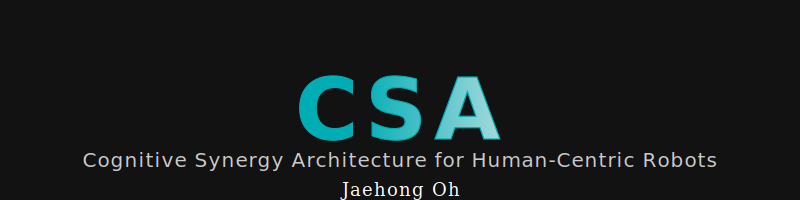
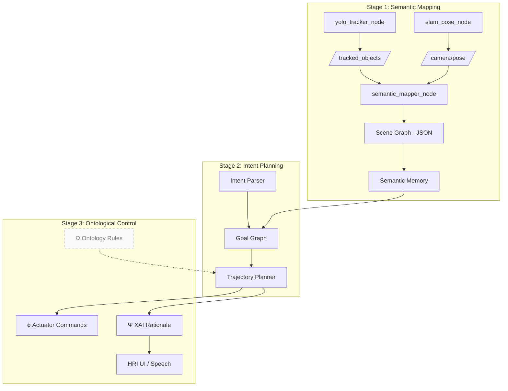

<!--
 ██████╗ ███████╗ ██████╗  ██████╗
██╔═══██╗██╔════╝██╔════╝ ██╔════╝
██║   ██║█████╗  ██║  ███╗██║  ███╗
██║   ██║██╔══╝  ██║   ██║██║   ██║
╚██████╔╝███████╗╚██████╔╝╚██████╔╝
 ╚═════╝ ╚══════╝ ╚═════╝  ╚═════╝

Cognitive Synergy Architecture (CSA)
A next-generation, research-grade cognition stack
for collaborative, human-centric robots
-->

<p align="center">
  
</p>

# 📚 Cognitive Synergy Architecture (CSA)

> **Modular cognition for robots that *perceive*, *reason*, and *co-think* with humans.**

CSA is a multistage robotics framework that unifies **semantic perception**, **adaptive planning**, and
**explainable control** under a single, ROS 2–native codebase.
It is organized into three tightly-coupled sub-architectures—**SEGO**, **IMAGO**, and **LOGOS**—that
together deliver a full perception-to-action loop with built-in reasoning, safety, and self-reflection.

| Sub-Architecture | Core Question                 | Key Capabilities (current state)                        |
|------------------|-------------------------------|---------------------------------------------------------|
| **SEGO**<br>*(Semantic Grounding Operator)* | “**What** exactly am I seeing?” | • Real-time RGB-D detection (YOLO v5)<br>• Multi-object tracking (StrongSORT)<br>• 6-DoF pose fusion (ORB-SLAM2 / RTAB-Map)<br>• 3-D semantic mapping + scene-graph export |
| **IMAGO**<br>*(Intent Modeling & Adaptive Goal Orchestration)* | “**Why** should I act and **how** do I adapt my plan?” | • Natural-language intent parsing (LLM plugin)<br>• Symbolic & neuro-symbolic planners (HTN, BT, CoT)<br>• PPO-based self-adaptation + meta-controller |
| **LOGOS**<br>*(Logic-Grounded Ontological Supervision)* | “Does my behaviour remain **safe**, **valid**, and **explainable**?” | • Run-time ontology checks (OWL 2, DL-query)<br>• Policy distillation → decision trees<br>• Human-readable rationales (XAI report) |

> **Status – 2025-06 14**   SEGO Stage-1 is feature-complete; IMAGO & LOGOS scaffolding is included but
> most PRs are still **WIP**.  
> **Road-mapped milestones** are listed [here »](#-roadmap--milestones).

---

> 📘 **Learn More**: This repository is based on the system architecture and cognitive vision proposed in  
> my own review paper:  
> _**"Towards Cognitive Collaborative Robots: Semantic-Level Integration and Explainable Control for Human-Centric Cooperation"**_,  
> [arXiv:2505.03815](https://arxiv.org/abs/2505.03815).  
>  
> This paper presents the conceptual and theoretical foundation for **CSA (Cognitive Synergy Architecture)** —  
> a modular framework that integrates semantic perception (SEGO), intention-aware planning (IMAGO),  
> and ontological reasoning with explainable control (LOGOS).  
>  
> ✨ This project aims to realize the vision outlined in the paper: to build robots that not only act,  
> but also understand — **semantically, ethically, and reflectively**, in collaboration with humans.

---

## 📑 Table of Contents
1. [Quick Start](#-quick-start)
1. [High-Level Architecture](#-high-level-architecture)
1. [Detailed Modules](#-module-breakdown-sego-stage-1)
1. [Installation Guide](#-installation--build)
1. [Runtime Walk-through](#-runtime-flow)
1. [Directory Layout](#-repository-layout)
1. [Troubleshooting & FAQ](#-troubleshooting--faq)
1. [Roadmap & Milestones](#-roadmap--milestones)

---

## 🚀 Quick Start

```bash
# 0 · Host prerequisites (Ubuntu 22.04 + ROS 2 Humble assumed)
sudo apt update && sudo apt install build-essential git lsb-release curl

# 1 · Clone
git clone https://github.com/<YOU>/CSA.git
cd CSA && git submodule update --init --recursive

# 2 · Setup ROS 2 & Python env
source /opt/ros/humble/setup.bash        # adjust if using another distro
python3 -m venv .venv && source .venv/bin/activate
pip install -U pip wheel
rosdep install --from-paths src -yi      # system deps

# 3 · Build (SEGO only)
colcon build --packages-select \
    csa_interfaces csa_yolo_inference csa_slam_interface csa_semantic_mapper
source install/setup.bash

# 4 · Run semantic mapping pipeline
ros2 launch csa_launch sego_pipeline.launch.py \
    camera_model:=realsense bag:=false visualize:=true
``` 


## 🧭 High-Level Architecture




Data Loop: sensor → semantic map → reasoning → plan → control → explanation

Safety Loop: LOGOS continuously validates each plan slice (Δt) via OWL-based
rules; if violation, a fallback BT and human prompt are triggered.

## 🔬 Module Breakdown (SEGO Stage-1)

### 1 · csa_yolo_inference

| Feature        | Implementation                           |
| -------------- | ---------------------------------------- |
| Detector       | YOLO v5 6.2 + Ultralytics API            |
| Tracker        | StrongSORT (boxmot fork)                 |
| Depth Sampling | RealSense D435 / any aligned depth topic |
| Output Message | `csa_interfaces/TrackedObjectArray`      |

### 2 · csa_slam_interface

Wraps ORB-SLAM2 (stereo/RGB-D) or RTAB-Map.
Publishes geometry_msgs/PoseStamped @ ≈30 Hz on /camera/pose.
Automatic time-sync with YOLO frames via TF + approx-time-policy.

### 3 · csa_semantic_mapper

Projects 2-D bounding boxes into 3-D world frame:
Builds an online scene graph (network-x) and dumps incremental
.json logs per track (ready for Neo4J ingestion).

``` bash
{
  "class"   : "cbn_wooden_box",
  "track_id": 27,
  "position": [ 0.773, -0.142, 1.035 ],
  "size"    : [ 0.28, 0.35, 0.12 ],     // meters
  "pose_cov": [ 5.2e-4, 8.9e-4, … ],
  "timestamp": 1715530123.447,
  "world_frame": "map",
  "source": {
    "camera_frame": "realsense_link",
    "depth_px": 713
  }
}
```
### 4 · Visualization

Launch RViz2 with pre-loaded config: /rviz/sego_live.rviz
Display: TF tree, /tracked_objects markers (ID-color keyed), occupancy map.


## 🖥️ Installation & Build

| Layer   | Package               | Version         | Install hint                                                                                        |
| ------- | --------------------- | --------------- | --------------------------------------------------------------------------------------------------- |
| System  | `Ubuntu`              | 22.04 LTS       | `apt …`                                                                                             |
| ROS 2   | `Humble Hawksbill`    | ≥ 0.11          | [link](https://docs.ros.org/en/humble/)                                                             |
| Vision  | `OpenCV`              | 4.9             | `apt install libopencv-dev`                                                                         |
| ML      | `PyTorch`             | 2.2 + CUDA-11.7 | `pip install torch torchvision torchaudio --extra-index-url https://download.pytorch.org/whl/cu117` |
| SLAM    | `ORB-SLAM2`           | custom          | included as git submodule                                                                           |
| Tracker | `boxmot`              | 0.2.x           | `pip install boxmot`                                                                                |
| Misc    | `pangolin` / `eigen3` | latest          | `apt install libeigen3-dev libgl1-mesa-dev`                                                         |


 ## 🎮 Runtime Flow

 | Step | Node                   | Topic                     | Rate  | Note                |
| ---- | ---------------------- | ------------------------- | ----- | ------------------- |
| ①    | **Sensor**             | `/camera/color/image_raw` | 30 Hz | RealSense RGB       |
| ②    | `yolo_tracker_node`    | `/tracked_objects`        | 15 Hz | after NMS + tracker |
| ③    | `slam_pose_node`       | `/camera/pose`            | 30 Hz | world–camera TF     |
| ④    | `semantic_mapper_node` | `/scene_graph` (latched)  | 2 Hz  | heavy but sparse    |
| ⑤    | `rviz2`                | markers                   | live  | for debugging       |

## 📂 Repository Layout

``` css
CSA/
├── docs/                 ← diagrams, papers, design notes
├── src/
│   ├── csa_interfaces/   ← ROS 2 msg definitions
│   ├── csa_yolo_inference/
│   ├── csa_slam_interface/
│   ├── csa_semantic_mapper/
│   ├── csa_utils/        ← time_sync, coord transforms
│   ├── csa_launch/
│   ├── imago_core/       ← planner skeleton (Stage 2)
│   └── logos_core/       ← ontology + XAI (Stage 3)
├── third_party/          ← submodules (ORB-SLAM2, pangolin…)
├── docker/
├── .devcontainer/        ← VS Code remote config
└── README.md             ← you are here

```

## 🗺️ Roadmap & Milestones

| Quarter | Theme                           | Deliverable                                    |
| ------- | ------------------------------- | ---------------------------------------------- |
| 2025 Q3 | **IMAGO α**                     | HTN planner; LLM intent parser                 |
| 2025 Q4 | **LOGOS α**                     | Live policy distillation + OWL safety layer    |
| 2026 Q1 | **Multi-robot** demo            | Cross-agent shared scene graphs                |
| 2026 Q2 | **HRI** pilot                   | Common-ground intent classifier, voice+gesture |
| 2026 Q4 | **Science Robotics** submission | End-to-end human+robots furniture assembly     |


