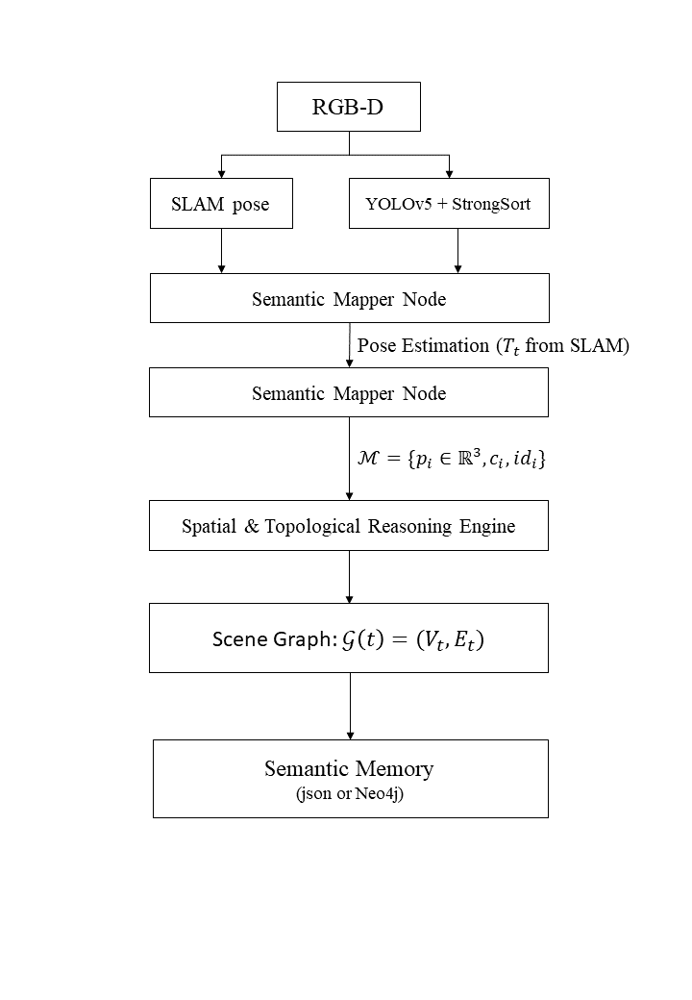
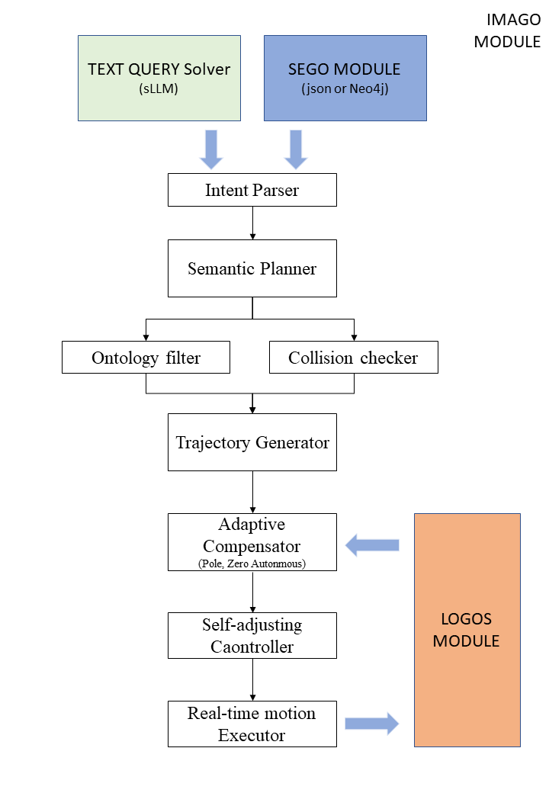
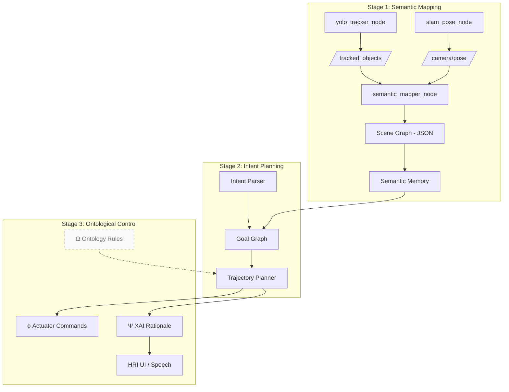
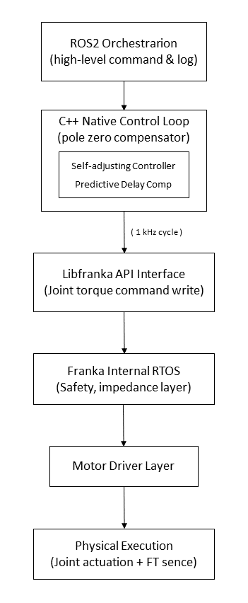

<!--
 ██████╗ ███████╗ ██████╗  ██████╗
██╔═══██╗██╔════╝██╔════╝ ██╔════╝
██║   ██║█████╗  ██║  ███╗██║  ███╗
██║   ██║██╔══╝  ██║   ██║██║   ██║
╚██████╔╝███████╗╚██████╔╝╚██████╔╝
 ╚═════╝ ╚══════╝ ╚═════╝  ╚═════╝

Cognitive Synergy Architecture (CSA)
A next-generation, research-grade cognition stack
for collaborative, human-centric robots
--> 

<p align="center">
  
</p>

# 📚 Cognitive Synergy Architecture (CSA)

---
## ✨ Project Summary

CSA (Cognitive Synergy Architecture) is an advanced ROS 2–native framework for human-centric robots.  
It integrates perception (SEGO), planning (IMAGO), and reasoning (LOGOS) for robots that **understand**  
their environment, **adapt** plans, and **explain** decisions in real time.  

This repository contains the codebase, architecture, and demo pipelines for CSA research and development.
---

> **Modular cognition for robots that *perceive*, *reason*, and *co-think* with humans.**

CSA is a multistage robotics framework that unifies **semantic perception**, **adaptive planning**, and
**explainable control** under a single, ROS 2–native codebase.
It is organized into three tightly-coupled sub-architectures **SEGO**, **IMAGO**, and **LOGOS** that
together deliver a full perception-to-action loop with built-in reasoning, safety, and self-reflection.

| Sub-Architecture | Core Question                 | Key Capabilities (current state)                        |
|------------------|-------------------------------|---------------------------------------------------------|
| **SEGO**<br>*(Semantic Graph Ontology mapper)* | “**What** exactly am I seeing?” | • Real-time RGB-D detection (YOLO v5)<br>• Multi-object tracking (StrongSORT)<br>• 6-DoF pose fusion (ORB-SLAM2 / RTAB-Map)<br>• 3-D semantic mapping + scene-graph export |
| **IMAGO**<br>*(Intent Modeling & Action Generation Operator)* | “**Why** should I act and **how** do I adapt my plan?” | • Natural-language intent parsing (LLM plugin)<br>• Symbolic & neuro-symbolic planners (HTN, BT, CoT)<br>• PPO-based self-adaptation + meta-controller |
| **LOGOS**<br>*(Logical Ontological Generator for Self-adjustment)* | “Does my behaviour remain **safe**, **valid**, and **explainable**?” | • Run-time ontology checks (OWL 2, DL-query)<br>• Policy distillation → decision trees<br>• Human-readable rationales (XAI report) |

> **Status – 2025-06 14**   SEGO Stage-1 is feature-complete; IMAGO & LOGOS scaffolding is included but
> most PRs are still **WIP**.  
> **Road-mapped milestones** are listed [here »](#-roadmap--milestones).

---

## 📘 Learn More

This repository is based on the system architecture and cognitive vision proposed in  
my own review papers:

- [_**"Towards Cognitive Collaborative Robots: Semantic-Level Integration and Explainable Control for Human-Centric Cooperation"**_](https://arxiv.org/abs/2505.03815)
- [_**"Cognitive Synergy Architecture: SEGO for Human-Centric Collaborative Robots"**_](https://arxiv.org/abs/2506.13149)

These papers present the conceptual and theoretical foundation for **CSA (Cognitive Synergy Architecture)** —  
a modular framework that integrates semantic perception (**SEGO**), intention-aware planning (**IMAGO**),  
and ontological reasoning with explainable control (**LOGOS**).

✨ This project aims to realize the vision outlined in these papers:  
to build robots that not only act, but also understand —  
**semantically, ethically, and reflectively**, in collaboration with humans.

---

## 📑 Table of Contents
1. [Quick Start](#-quick-start)
1. [High-Level Architecture](#-high-level-architecture)
1. [Detailed Modules](#-module-breakdown-sego-stage-1)
1. [Installation Guide](#-installation--build)
1. [Runtime Walk-through](#-runtime-flow)
1. [Directory Layout](#-repository-layout)
1. [Roadmap & Milestones](#-roadmap--milestones)

---

## 🚀 Quick Start

```bash
# 0 · Host prerequisites (Ubuntu 22.04 + ROS 2 Humble assumed)
sudo apt update && sudo apt install build-essential git lsb-release curl

# 1 · Clone
git clone https://github.com/jack0682/CSA.git
cd CSA && git submodule update --init --recursive

# 2 · Setup ROS 2 & Python env
source /opt/ros/humble/setup.bash        # adjust if using another distro
python3 -m venv .venv && source .venv/bin/activate
pip install -U pip wheel
rosdep install --from-paths src -yi      # system deps

# 3 · Build (SEGO only)
colcon build --packages-select \
    csa_interfaces csa_yolo_inference csa_slam_interface csa_semantic_mapper
source install/setup.bash

# 4 · Run semantic mapping pipeline
ros2 launch csa_launch sego_pipeline.launch.py \
    camera_model:=realsense bag:=false visualize:=true
```

## SEGO System Pipeline


## IMAGO System Pipeline



---

## 🧭 High-Level Architecture




Data Loop: sensor → semantic map → reasoning → plan → control → explanation

Safety Loop: LOGOS continuously validates each plan slice (Δt) via OWL-based
rules; if violation, a fallback BT and human prompt are triggered.

## 🔬 Module Breakdown (SEGO Stage-1)

### 1 · csa_yolo_inference

| Feature        | Implementation                           |
| -------------- | ---------------------------------------- |
| Detector       | YOLO v5 6.2 + Ultralytics API            |
| Tracker        | StrongSORT (boxmot fork)                 |
| Depth Sampling | RealSense D435 / any aligned depth topic |
| Output Message | `csa_interfaces/TrackedObjectArray`      |

### 2 · csa_slam_interface

Wraps ORB-SLAM2 (stereo/RGB-D) or RTAB-Map.
Publishes geometry_msgs/PoseStamped @ ≈30 Hz on /camera/pose.
Automatic time-sync with YOLO frames via TF + approx-time-policy.

### 3 · csa_semantic_mapper

Projects 2-D bounding boxes into 3-D world frame:
Builds an online scene graph (network-x) and dumps incremental
.json logs per track (ready for Neo4J ingestion).

``` bash
{
  "class"   : "cbn_wooden_box",
  "track_id": 27,
  "position": [ 0.773, -0.142, 1.035 ],
  "size"    : [ 0.28, 0.35, 0.12 ],     // meters
  "pose_cov": [ 5.2e-4, 8.9e-4, … ],
  "timestamp": 1715530123.447,
  "world_frame": "map",
  "source": {
    "camera_frame": "realsense_link",
    "depth_px": 713
  }
}
```
### 4 · Visualization

Launch RViz2 with pre-loaded config: /rviz/sego_live.rviz
Display: TF tree, /tracked_objects markers (ID-color keyed), occupancy map.


## 🖥️ Installation & Build

| Layer   | Package               | Version         | Install hint                                                                                        |
| ------- | --------------------- | --------------- | --------------------------------------------------------------------------------------------------- |
| System  | `Ubuntu`              | 22.04 LTS       | `apt …`                                                                                             |
| ROS 2   | `Humble Hawksbill`    | ≥ 0.11          | [link](https://docs.ros.org/en/humble/)                                                             |
| Vision  | `OpenCV`              | 4.9             | `apt install libopencv-dev`                                                                         |
| ML      | `PyTorch`             | 2.2 + CUDA-11.7 | `pip install torch torchvision torchaudio --extra-index-url https://download.pytorch.org/whl/cu117` |
| SLAM    | `ORB-SLAM2`           | custom          | included as git submodule                                                                           |
| Tracker | `boxmot`              | 0.2.x           | `pip install boxmot`                                                                                |
| Misc    | `pangolin` / `eigen3` | latest          | `apt install libeigen3-dev libgl1-mesa-dev`                                                         |


 ## 🎮 Runtime Flow

 | Step | Node                   | Topic                     | Rate  | Note                |
| ---- | ---------------------- | ------------------------- | ----- | ------------------- |
| ①    | **Sensor**             | `/camera/color/image_raw` | 30 Hz | RealSense RGB       |
| ②    | `yolo_tracker_node`    | `/tracked_objects`        | 15 Hz | after NMS + tracker |
| ③    | `slam_pose_node`       | `/camera/pose`            | 30 Hz | world–camera TF     |
| ④    | `semantic_mapper_node` | `/scene_graph` (latched)  | 2 Hz  | heavy but sparse    |
| ⑤    | `rviz2`                | markers                   | live  | for debugging       |

## 📂 Repository Layout

``` css
CSA/
├── docs/                 ← diagrams, papers, design notes
├── src/
│   ├── csa_interfaces/   ← ROS 2 msg definitions
│   ├── csa_yolo_inference/
│   ├── csa_slam_interface/
│   ├── csa_semantic_mapper/
│   ├── csa_utils/        ← time_sync, coord transforms
│   ├── csa_launch/
│   ├── imago_core/       ← planner skeleton (Stage 2)
│   └── logos_core/       ← ontology + XAI (Stage 3)
├── third_party/          ← submodules (ORB-SLAM2, pangolin…)
├── docker/
├── .devcontainer/        ← VS Code remote config
└── README.md             ← you are here

```

## 🗺️ Roadmap & Milestones

| Quarter | Theme                           | Deliverable                                    |
| ------- | ------------------------------- | ---------------------------------------------- |
| 2025 Q3 | **IMAGO α**                     | HTN planner; LLM intent parser                 |
| 2025 Q4 | **LOGOS α**                     | Live policy distillation + OWL safety layer    |
| 2026 Q1 | **Multi-robot** demo            | Cross-agent shared scene graphs                |
| 2026 Q2 | **HRI** pilot                   | Common-ground intent classifier, voice+gesture |
| 2026 Q4 | **Science Robotics** submission | End-to-end human+robots furniture assembly     |

---

# IMAGO Control Architecture Backbone

---

## ⚙️ IMAGO + Panda Integrated Design

 

---

## ⚙️ IMAGO Core Structure

### High-Level Input

- **TEXT QUERY**  
  Parses user language or natural language commands into intent representations.  
  Connected with an sLLM-based text query and answering system.

- **SEGO MODULE**  
  Provides semantic information via scene graphs.  
  Utilizes SEGO Scene Graph and Ontology Database.

---

### Control Layer

- **Adaptive Compensator (Pole-Zero Autonomous)**  
  Real-time error correction based on pole-zero compensation.  
  Receives rule/state feedback from the LOGOS MODULE for compensator adjustment.

- **Self-Adjusting Controller**  
  Adaptive control optimization.

- **Real-Time Motion Executor**  
  Executes final motion commands at the physical level.

---

### LOGOS Interaction

- **Adaptive Compensator & LOGOS MODULE:**  
  Pole-zero compensation rule exchange  
  Real-time rule optimization  
  Meta-level reasoning feedback  
  Handshake with real-time executor  

---

## ⚙️ Robot Arm Requirements

✅ Provides joint-level control interface (Torque / Velocity / Position)  
✅ Real-time control loop period <1ms (RTOS or RT-capable)  
✅ Modifiable controller (Open Source or SDK provided)  
✅ Access to high-performance sensors/drivers (Force-Torque, Encoders)  
✅ Easy ROS2 or RTAPI integration  
✅ Low-level bus access (e.g., EtherCAT, CANopen)  
✅ Public SDK / HAL available  

👉 Target robot arm: **Franka Emika Panda**

---

## ⏱ Delay Issues and Architectural Limitations

- `libfranka API` provides access above the HAL wrapping layer.  
- Torque commands are injected after internal impedance safety layers.  
- Latency accumulates through ROS2 → API → internal RT thread → driver stack.  
- Estimated accumulated delay: **3–5 ms**, which threatens phase margin and may induce oscillations.

---

## 📐 IMAGO Control Formulation

### Plant Model

$$
G(s) = \frac{1}{J s^2 + B s}
$$

---

### Pole-Zero Compensator Design

Ideal design target:

$$
C(s) G(s) = 1
$$

Actual compensator:

$$
C(s) = J' s^2 + B' s
$$

---

### Delay-Aware Controller

With delay:

$$
G_d(s) = G(s) e^{-s \Delta t}
$$

Effective compensator:

$$
C(s) G_d(s) = C(s) G(s) e^{-s \Delta t}
$$

Phase margin degradation:

$$
\Phi_{\text{margin,eff}} = \Phi_{\text{design}} - 360 f \Delta t
$$

---

### Delay Compensation

Lead compensator form:

$$
C_{\text{delay}}(s) = \frac{\alpha T_{\text{lead}} s + 1}{T_{\text{lead}} s + 1}, \quad 0 < \alpha < 1
$$

Smith predictor (model-based):

$$
\tau_{\text{cmd}}(s) = C(s) \frac{G(s)}{G_d(s)} r(s)
$$

Final torque command:

$$
\tau_{\text{cmd}}(s) = \left( J' s^2 + B' s \right) C_{\text{delay}}(s) e^{+s \Delta t} r(s)
$$

---

### Wrapping Transfer Function

$$
\tau_{\text{actual}}(s) = H_{\text{int}}(s) C(s) C_{\text{delay}}(s) e^{+s \Delta t} r(s)
$$

Where:

$$
H_{\text{int}}(s) = \frac{\theta(s)}{\tau(s)} = \frac{1}{M s^2 + B s}
$$

---

### Nonlinear MIMO Dynamics

$$
M(\theta) \ddot{\theta} + C(\theta, \dot{\theta}) \dot{\theta} + G(\theta) = \tau_{\text{actual}}
$$

$$
M(\theta) = \sum_{i=1}^6 M_i(\theta_1, \dots, \theta_i)
$$

$$
C(\theta, \dot{\theta}) = \sum_{i=1}^6 \sum_{j=1}^6 c_{ij}(\theta) \dot{\theta}_j
$$

$$
c_{ij}(\theta) = \frac{1}{2} \left[
\frac{\partial M_{ij}}{\partial \theta_j} +
\frac{\partial M_{ij}}{\partial \theta_i} +
\frac{\partial M_{jj}}{\partial \theta_i}
\right]
$$

$$
G(\theta) = \sum_{i=1}^6 g_i(\theta)
$$

---

## 🔧 Self-Adjusting Adaptive Control Law

Adaptive update:

$$
\dot{K} = -\alpha e(t) \dot{e}(t)
$$

Lyapunov function:

$$
V = \frac{1}{2} e^\top P e, \quad \dot{V} = -e^\top Q e \leq 0
$$

With delay compensation:

$$
e_J(t - \Delta t), \quad e_B(t - \Delta t)
$$

---

## ⚙️ Multi-Robot End-Effector Plan Synchronization

Global plan reference:

$$
\chi_d^{\text{ref}}(t)
$$

Synchronization constraint:

$$
\forall i,j: 
\left\| \chi_d^{\text{ee,i}}(t) - \chi_d^{\text{ref}}(t) \right\| < \varepsilon_{\text{sync},ij} \quad \wedge \quad 
\left| \Delta t^i - \Delta t^j \right| < \varepsilon_{\text{latency}}
$$

Synchronization torque:

$$
\tau_{\text{actual}}^i(s) \leftarrow \tau_{\text{actual}}^i(s) +
K_{\text{sync}} \sum_j \left( \chi_d^{\text{ee,j}}(t) - \chi_d^{\text{ee,i}}(t) \right)
$$

---

## ⚙️ Final IMAGO Wrapping Control Structure

$$
\tau_{\text{actual}}(s) = H_{\text{int}}(s) C^{\text{ML}}(s) C_{\text{delay}}(s) e^{+s \Delta t} \mathcal{L} \theta_d^{\text{final}}(t)
$$

---

## Notes

- **Franka internal controller:**  
  RTOS + safety layers + motor driver layers → user control applies above HAL.  
  Internal safety core modification is not allowed.

- **libfranka loop:**  
  1 kHz control loop → 1 ms period  
  ROS2 → C++ API call → internal RT thread  

- **Delay accumulation risk:**  
  Accumulated delay of several ms reduces phase margin, induces oscillation or overshoot.

---

## Potential Extended Formulations

- Multi-joint Smith predictor:

$$
\tau_{\text{cmd}}(s) = \sum_{i=1}^6 C_i(s) \frac{G_i(s)}{G_{d,i}(s)} r_i(s)
$$

- Frequency response with delay:

$$
|C(j\omega) G(j\omega)| \angle e^{-j \omega \Delta t}
$$

- Phase margin with frequency dependency:

$$
\Phi_{\text{margin,eff}}(\omega) = \Phi_{\text{design}}(\omega) - 360 \frac{\omega}{2 \pi} \Delta t
$$

---

``` css
imago_controller/
├── CMakeLists.txt                  # ROS2 + C++ 빌드 파일
├── package.xml                      # ROS2 패키지 메타 정보
├── launch/
│   └── imago_controller.launch.py   # ROS2 launch 파일
├── config/
│   ├── controller_params.yaml       # IMAGO 파라미터 (J, B, delay 등)
│   └── sync_params.yaml             # 다중 로봇 sync 파라미터
├── include/
│   └── imago_controller/
│       ├── imago_controller.hpp          # 메인 클래스 선언
│       ├── pole_zero_compensator.hpp     # Pole-Zero 보상기 클래스
│       ├── delay_compensator.hpp         # Delay-aware 보상기 클래스
│       ├── ml_estimator.hpp              # ML 기반 inertia/Coriolis/gravity 추정
│       ├── sync_manager.hpp              # 다중 로봇 sync 관리
│       ├── low_level_interface.hpp       # libfranka / EtherCAT 인터페이스
│       └── utils.hpp                     # 공통 함수 (matrix ops, logging 등)
├── src/
│   ├── imago_controller.cpp              # 메인 control loop
│   ├── pole_zero_compensator.cpp
│   ├── delay_compensator.cpp
│   ├── ml_estimator.cpp
│   ├── sync_manager.cpp
│   ├── low_level_interface.cpp
│   └── main.cpp                          # ROS2 노드 진입점
├── urdf/
│   └── panda_with_imago.urdf.xacro       # Panda + IMAGO 추가 링크/센서 URDF
├── meshes/
│   └── (필요 시 custom link/EE mesh 파일)
├── scripts/
│   └── test_plot.py                      # Latency/torque/sync 데이터 시각화
├── tests/
│   └── test_imago_controller.cpp         # gtest 기반 유닛테스트
├── docs/
│   └── design_overview.md                # 설계 문서
├── data_logs/
│   └── (실험 중 생성되는 log 파일 저장)
└── README.md                             # 전체 개요 설명


```
